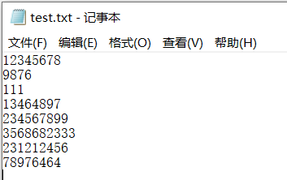
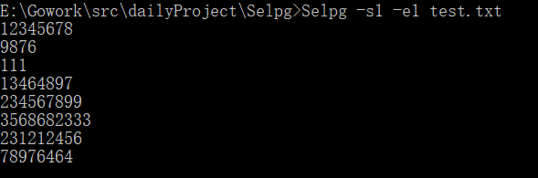
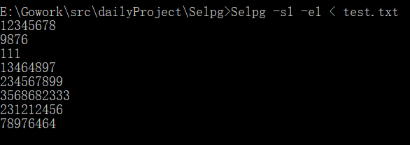
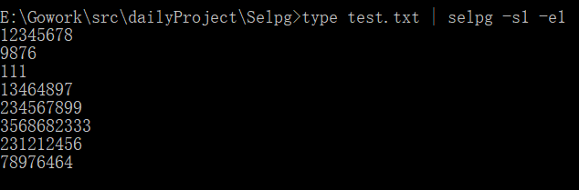
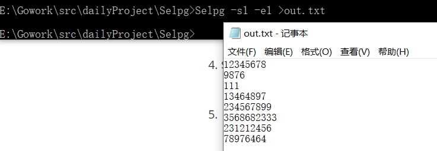

# CLI 命令行实用程序开发基础

[TOC]

## 1. 概述

> CLI（Command Line Interface）实用程序是Linux下应用开发的基础。正确的编写命令行程序让应用与操作系统融为一体，通过shell或script使得应用获得最大的灵活性与开发效率。Linux提供了cat、ls、copy等命令与操作系统交互；go语言提供一组实用程序完成从编码、编译、库管理、产品发布全过程支持；容器服务如docker、k8s提供了大量实用程序支撑云服务的开发、部署、监控、访问等管理任务；git、npm等都是大家比较熟悉的工具。尽管操作系统与应用系统服务可视化、图形化，但在开发领域，CLI在编程、调试、运维、管理中提供了图形化程序不可替代的灵活性与效率。

## 2. 基础知识

> 几乎所有语言都提供了完善的 CLI 实用程序支持工具。

POSIX/GNU 命令行接口的一些概念与规范。命令行程序主要涉及内容：

- 命令
- 命令行参数
- 选项：长格式、短格式
- IO：stdin、stdout、stderr、管道、重定向
- 环境变量

## 3. Golang 的支持

使用os，flag包，最简单处理参数的代码：

```go
package main

import (
    "fmt"
    "os"
)

func main() {
    for i, a := range os.Args[1:] {
        fmt.Printf("Argument %d is %s\n", i+1, a)
    }
}
```

```go
package main

import (
    "flag" 
    "fmt"
)

func main() {
    var port int
    flag.IntVar(&port, "p", 8000, "specify port to use.  defaults to 8000.")
    flag.Parse()

    fmt.Printf("port = %d\n", port)
    fmt.Printf("other args: %+v\n", flag.Args())
}
```

> 参考文档：
>
> [标准库—命令行参数解析FLAG]([http://blog.studygolang.com/2013/02/%E6%A0%87%E5%87%86%E5%BA%93-%E5%91%BD%E4%BB%A4%E8%A1%8C%E5%8F%82%E6%95%B0%E8%A7%A3%E6%9E%90flag/](http://blog.studygolang.com/2013/02/标准库-命令行参数解析flag/))
>
> [Go学习笔记：flag库的使用](https://studygolang.com/articles/5608)

## 4. 开发实践

> 使用 golang  [开发 Linux 命令行实用程序](https://www.ibm.com/developerworks/cn/linux/shell/clutil/index.html) 中的 **selpg**

我们先来看看selpg的程序逻辑（引用自[开发 Linux 命令行实用程序](https://www.ibm.com/developerworks/cn/linux/shell/clutil/index.html)）

> selpg 是从文本输入选择页范围的实用程序。该输入可以来自作为最后一个命令行参数指定的文件，在没有给出文件名参数时也可以来自标准输入。selpg 首先处理所有的命令行参数。在扫描了所有的选项参数（也就是那些以连字符为前缀的参数）后，如果 selpg 发现还有一个参数，则它会接受该参数为输入文件的名称并尝试打开它以进行读取。如果没有其它参数，则 selpg 假定输入来自标准输入。

### 依赖包

```go
import (
	"bufio"
	"errors"
	"io"
	"log"
	"os"
	"os/exec"

	"github.com/spf13/pflag"
)
```

pflag更多用法参考[GODOC](https://godoc.org/github.com/spf13/pflag)

### 全局变量

第三方的命令行参数解析包 pflag 比 flag 包使用的更为广泛。pflag 包的设计目的就是替代标准库中的 flag 包，因此它具有更强大的功能并且与标准的兼容性更好。

```go
//Define variables corresponding to command line parameters
//IntP is like Int, but accepts a shorthand letter that can be used after a single dash.
var startPage = pflag.IntP("startPage", "s", -1, "Specify the start page of the page range to extract")
var endPage = pflag.IntP("endPage", "e", -1, "Specify the end page of the page range to extract")
var lineNum = pflag.IntP("lineNum", "l", 72, "Fixed number of page rows")
var fToSkip = pflag.BoolP("fToSkip", "f", false, "Pages of this type of text are delimited by ASCII page-feed characters")
var destPrinter = pflag.StringP("destPrinter", "d", "", "Acceptable print destination name")
```

定义完命令行参数之后，需要通过`pflag.Parse()`解析参数之后，才可以使用上面所定义的全局变量

### 参数处理

1. “-sNumber”和“-eNumber”强制选项：

   selpg 要求用户用两个命令行参数“-sNumber”（例如，“-s10”表示从第 10 页开始）和“-eNumber”（例如，“-e20”表示在第 20 页结束）指定**要抽取的页面范围的起始页和结束页**。selpg 对所给的页号进行**合理性检查**；换句话说，它会检查两个数字是否为有效的正整数以及结束页是否不小于起始页。而且必须是命令行上在命令名 selpg 之后的头两个参数

   ```shell
   $ selpg -s10 -e20 ...		#.. 是命令的余下部分
   ```

2. ”-lNumber”和“-f”可选选项：

   selpg 可以处理两种输入文本：

   - 该类文本的页行数固定。这是缺省类型，如果既没有给出“-lNumber”也没有给出“-f”选项，则 selpg 会理解为页有固定的长度（每页 72 行）

     ```shell
     $ selpg -s10 -e20 -l66 ...
     ```

   - 该类型文本的页由 ASCII 换页字符（十进制数值为 12，在 C 中用“\f”表示）定界。打印机会识别换页符并自动根据在新的页开始新行所需的行数移动打印头。

     ```shell
     $ selpg -s10 -e20 -f ...
     ```

3. “-dDestination”可选选项：

   selpg 还允许用户使用“-dDestination”选项将选定的页**直接发送至打印机**。若要验证该选项是否已生效，请运行命令“lpstat -t”。该命令应该显示添加到“Destination”打印队列的一项打印作业。如果当前有打印机连接至该目的地并且是启用的，则打印机应打印该输出。

### 参数校验

根据上面的参数处理逻辑，我们写一个校验函数来处理，返回值是error类型值

```go
func check() error {
	if *startPage == -1 || *endPage == -1 {
		return errors.New("\"-sNumber\" and \"-eNumber\" are required and\r\nmust be the first two arguments on the command line after the command name selpg")
	}
	if *startPage <= 0 || *startPage > 10 {
		return errors.New("The start page is out of range")
	}
	if *endPage <= 0 || *endPage > 10 {
		return errors.New("The end page is out of range")
	}
	if *startPage > *endPage {
		return errors.New("The end page must be no smaller than the start page")
	}
	if *lineNum != 72 && *fToSkip {
		return errors.New("The \"-lNumber\" and \"-f\" options are mutually exclusive")
	}
	return nil
}
```

### 获取输入

应该允许输入来自以下两种方式：

1. 在命令行上指定的文件名
2. 标准输入（stdin），缺省情况下为终端（也就是用户的键盘）

```shell
#First situation
$ command input_file	#在这个例子中，command 应该读取文件 input_file

#Second situation
$ command				#用户输入 Control-D（文件结束指示符）前输入的所有内容都成为 command 的输入
```

使用shell操作符也能实现重定向

```shell
$ command < input_file
#command 会读它的标准输入，不过 shell／内核已将其重定向，所以标准输入来自 input_file

$ other_command | command		
#other_command 的标准输出（stdout）被 shell／内核透明地传递至 command 的标准输入
```

于是，我们定义一个函数，找到我们所需要的输入

如果第一个非解析参数为空，则其作为输入文件，否则第一个文件作为输入文件

```go
func findRead() (*bufio.Reader, error) {
	//NArg is the number of arguments remaining after flags have been processed.
	if pflag.NArg() == 0 {
		return bufio.NewReader(os.Stdin), nil
	} else if pflag.NArg() == 1 {
		fp, err := os.Open(pflag.Arg(0))
		if err != nil {
			return nil, err
		}
		return bufio.NewReader(fp), nil
	} else {
		return nil, errors.New("Excess parameters detected")
	}
}
```

读取文件有三种方式：（**io/ioutil**   /   **os**  /  **bufio.Reader**）

- 将文件整个读入内存（os.Open() / ioutil.ReadAll() ）
- 按字节数读取（os.Open() / bufio.NewReader() / reader.Read()）
- 按行读取（os.OpenFile() / bufio.NewReader() / ReadString()）

这里我们选择使用`bufio.Reader`，因为`bufio`包实现了缓存IO,它本身包装了`io.Reader`和`io.Writer`对象，创建了另外的Reader和Writer对象，不过该种方式是带有缓存的，因此对于文本I/O来说，该包是提供了一些便利的。因此，下面的输出我们也是用bufio

### 获取输出

```shell
$ command				
#输出应该被写至标准输出，缺省情况下标准输出同样也是终端（也就是用户的屏幕）

$ command > output_file
#使用 shell 操作符“>”（重定向标准输出）可以将标准输出重定向至文件

$ command | other_command
#使用“|”操作符，command 的输出可以成为另一个程序的标准输入
```

```go
func findWrite() (*bufio.Writer, *exec.Cmd, io.WriteCloser, error) {
	if *destPrinter == "" {
		return bufio.NewWriter(os.Stdout), nil, nil, nil
	} else {
		cmd := exec.Command("lp", "-d"+*destPrinter)
		input, err := cmd.StdinPipe()
		if err != nil {
			return nil, nil, nil, err
		}
		cmd.Stdout = os.Stdout
		return bufio.NewWriter(input), cmd, input, nil
	}
}
```

Package command 为运行命令提供了一个可注入的接口和实现。

> func (c *Cmd) StdinPipe() (io.WriteCloser, error)
>
> StdinPipe returns a pipe that will be connected to the command's standard input when the command starts. The pipe will be closed automatically after Wait sees the command exit. A caller need only call Close to force the pipe to close sooner. For example, if the command being run will not exit until standard input is closed, the caller must close the pipe.

由于cmd的输入是selpg的输出，所以要将cmd的输入管道连接到selpg的输出管道

### 错误输出

```go
#之前所有的运行都会有一个err的返回值
#通过log.Fatal作为错误输出
if err != nil {
		log.Fatal(err)
	}
```

### 分页读取输出

先通过findRead函数获取输入io

再通过findwriter函数获取输出io

根据参数设定分页符为`\f` / `\n`多少页

如果cmd不为空，则表示另一外部程序需要输入并执行，运行cmd.Run()

最后再判断 输入的页数范围是否合理

```go
func printRes() error {
	reader, err := findRead()
	if err != nil {
		return err
	}
	writer, cmd, input, err := findWrite()
	if err != nil {
		return err
	}
	page := 1
	line := 0
	var delim byte
	if *fToSkip {
		delim = '\f'
	} else {
		delim = '\n'
	}
	for {
		content, err := reader.ReadBytes(delim)
		if err != nil {
			if err != io.EOF {
				return err
			} else {
				break
			}
		}
		if page >= *startPage && page <= *endPage {
			_, err := writer.WriteString(string(content))
			writer.Flush()
			if err != nil {
				return err
			}
		}
		if *fToSkip {
			page++
		} else {
			if line++; line == *lineNum {
				line = 0
				page++
			}
		}
	}
	if cmd != nil {
		input.Close()
		if err := cmd.Run(); err != nil {
			return err
		}
	}
	if page < *startPage || page < *endPage {
		return errors.New("The start page is out of the range of text pages")
	}
	return nil
}
```

### 主函数

```go
func main() {
	pflag.Parse()
	err := printRes()
	if err != nil {
		log.Fatal(err)
	}
}
```

## 5.测试

**由于在Windows环境开发，且没有打印机，为了测试，将cmd内命令改为exec.Command("findstr", "1")**

测试文件



1. selpg -s1 -e1 input_file

   

2. $ selpg -s1 -e1 < input_file

   

3. $ other_command | selpg -s10 -e20

   

4. $ selpg -s10 -e20 input_file >output_file

   

5. 