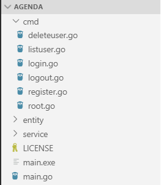
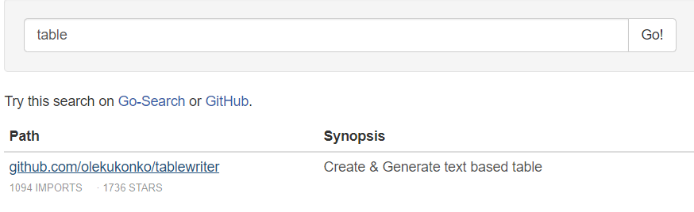
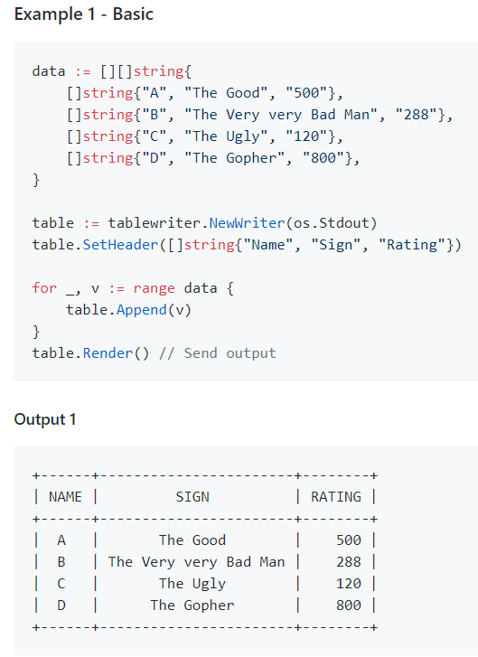
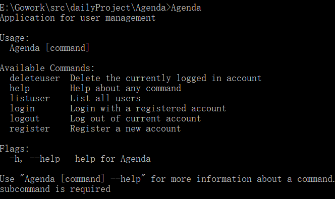
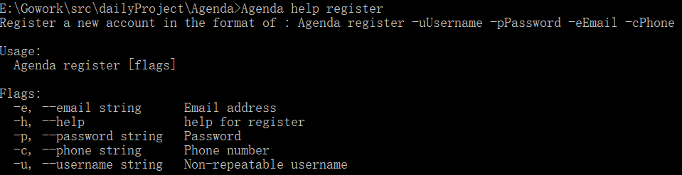
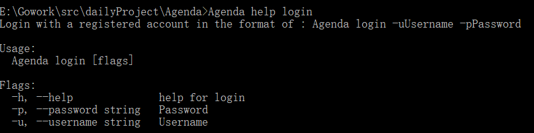
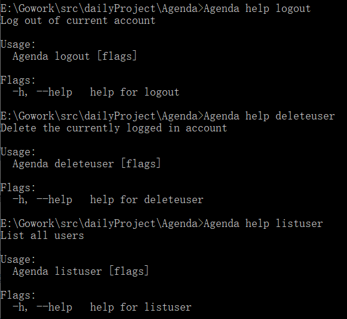

# CLI 命令行实用程序开发实战 - Agenda

[TOC]

[Github地址]( https://github.com/wywwwwei/ServiceComputingOnCloud/tree/master/HW4_Agenda )

[Go-Online地址]( http://www.go-online.org.cn:8080/share/bmqthom76kvmo1a8888g?secret=false)

## 概述

命令行实用程序并不是都象 cat、more、grep 是简单命令。[go](https://go-zh.org/cmd/go/) 项目管理程序，类似 java 项目管理 [maven](http://maven.apache.org/)、Nodejs 项目管理程序 [npm](https://www.npmjs.com/)、git 命令行客户端、 docker 与 kubernetes 容器管理工具等等都是采用了较复杂的命令行。即一个实用程序同时支持多个子命令，每个子命令有各自独立的参数，命令之间可能存在共享的代码或逻辑，同时随着产品的发展，这些命令可能发生功能变化、添加新命令等。因此，符合 [OCP 原则](https://en.wikipedia.org/wiki/Open/closed_principle) 的设计是至关重要的编程需求。

### 任务目标

1. 熟悉 go 命令行工具管理项目
2. 综合使用 go 的函数、数据结构与接口，编写一个简单命令行应用 agenda
3. 使用面向对象的思想设计程序，使得程序具有良好的结构命令，并能方便修改、扩展新的命令,不会影响其他命令的代码
4. 项目部署在 Github 上，合适多人协作，特别是代码归并
5. 支持日志（原则上不使用debug调试程序）

## Agenda 开发项目

### 需求描述

- 功能需求： 设计一组命令完成 agenda 的管理，例如：

  - agenda help ：列出命令说明
  - agenda register -uUserName –password pass –email=a@xxx.com ：注册用户
  - agenda help register ：列出 register 命令的描述
  - agenda cm … : 创建一个会议
  - 原则上一个命令对应一个业务功能

- 持久化要求：

  - 使用 json 存储 User 和 Meeting 实体
  - 当前用户信息存储在 curUser.txt 中

- 业务需求：

  **用户注册**

  1. 注册新用户时，用户需设置一个唯一的用户名和一个密码。另外，还需登记邮箱及电话信息。
  2. 如果注册时提供的用户名已由其他用户使用，应反馈一个适当的出错信息；成功注册后，亦应反馈一个成功注册的信息。

  **用户登录**

  1. 用户使用用户名和密码登录 Agenda 系统。
  2. 用户名和密码同时正确则登录成功并反馈一个成功登录的信息。否则，登录失败并反馈一个失败登录的信息。

  **用户登出**

  1. 已登录的用户登出系统后，只能使用用户注册和用户登录功能。

  **用户查询**

  1. 已登录的用户可以查看已注册的所有用户的用户名、邮箱及电话信息。

  **用户删除**

  1. 已登录的用户可以删除本用户账户（即销号）。
  2. 操作成功，需反馈一个成功注销的信息；否则，反馈一个失败注销的信息。
  3. 删除成功则退出系统登录状态。删除后，该用户账户不再存在。

## 实验过程

### 首先安装Cobra包 

` https://godoc.org/github.com/spf13/cobra `

由于缺少依赖包，且无法获取，手动下载

```shell
cd %GOPATH%/src/golang.org/x
git clone https://github.com/golang/text.git
git clone https://github.com/golang/sys.git
```

然后安装cobra

```shell
go get -u github.com/spf13/cobra/cobra
```

### 使用cobra生成应用程序

```shell
cd %GOPATH%/src/dailyProject	#dailyProject is the directory where you put the project
cobra init --pkg-name Agenda
cobra add register
cobra add login
cobra add logout
cobra add listuser
cobra add deleteuser
```

下图为创建完项目后得文件结构



在main.go中，只有一个简单地执行cmd包，所以我们需要在cmd包内调用具体的实现包来实现Agenda程序的需求 

```go
package main

import "dailyProject/Agenda/cmd"

func main() {
	cmd.Execute()
}
```

我们再看一下 root.go，这里cmd包进行了一些初始化操作并提供了Execute接口， viper是cobra集成的配置文件读取的库，这里不需要使用，我们可以注释掉（不注释可能生成的应用程序很大约10M，这里没有用到最好是注释掉），

而其他子命令的包只有初始化函数，将子命令结构体添加到rootCmd，所以我们先去实现具体的功能，再回来调用即可。

### 编写Entity包

1. 用户 结构体

   ```go
   //User contains user information
   type User struct {
   	Username string `json:"username"`
   	Password string `json:"password"`
   	Email    string `json:"email"`
   	Phone    string `json:"phone"`
   }
   ```

2. 当前用户 结构体

   ```go
   type CurUser struct {
   	CurUsername string `json:"username"`
   	CurPassword string `json:"password"`
   }
   ```

3. Storage 结构体和方法，实现可持续化存储(Storage 管理着 所有注册用户列表)

    -  定义存储位置

       ```go
       const userPath = "./entity/data/user.json"
       const curUserPath = "./entity/data/curUser.txt"
       ```
   
   - 首先，我使用了单例模式，其实这里是命令行程序，不做单例模式也可以，不过一开始就做了，好像也没什么问题……
   
     ```go
     type Storage struct {
     	mDirty   bool
     	userList []User
     }
     
     var singleStorage *Storage
     
     //GetInstance returns the pointer of the instance of Storage
     func GetInstance() *Storage {
  	if singleStorage == nil {
     		singleStorage = &Storage{mDirty: false}
  		singleStorage.readFromFile(userPath, &singleStorage.userList)
     	}
     	return singleStorage
     }
     ```
   
   - 提供一个读文件的方法
   
     ```go
     func (s *Storage) readFromFile(path string, v interface{}) error {
     	jsonFile, err := os.Open(path)
     	if err != nil {
  		return err
     	}
  	defer jsonFile.Close()
     
     	return json.NewDecoder(jsonFile).Decode(v)
     }
     ```
   
   - 提供一个写文件的方法
   
     ```go
     func (s *Storage) writeToFile(path string, v interface{}) error {
     	if !s.mDirty && path == userPath {
     		return nil
     	}
     
     	jsonFile, err := os.Create(path)
     	if err != nil {
  		return err
     	}
     	defer jsonFile.Close()
     
     	return json.NewEncoder(jsonFile).Encode(v)
     }
     ```
   
   - 提供一个写文件的方法
   
     ```go
     func (s *Storage) writeToFile(path string, v interface{}) error {
     	if !s.mDirty && path == userPath {
     		return nil
     	}
     
     	jsonFile, err := os.Create(path)
     	if err != nil {
     		return err
     	}
     	defer jsonFile.Close()
     
     	return json.NewEncoder(jsonFile).Encode(v)
     }
     ```
   
   - （Storage层面的）添加/删除用户，供Service调用
   
     ```go
     //UpdateUser is called by the service class to update the user json file
     func (s *Storage) UpdateUser() error {
     	return s.writeToFile(userPath, &s.userList)
     }
     
     //CreateUser is called by the service class to create a user
     func (s *Storage) CreateUser(u User) error {
     	s.userList = append(s.userList, u)
     
     	return s.UpdateUser()
     }
     
     //DeleteUser is called by the service class to delete a user
     func (s *Storage) DeleteUser(uf UserFilter) error {
     
     	for i, v := range s.userList {
     		if uf(v.Username, v.Password) {
     			s.userList = append(s.userList[:i], s.userList[i+1:]...)
     			break
     		}
     	}
     	return s.UpdateUser()
     }
     ```
   
   - 查询用户，供Service调用
   
     这里还定义了一个UserFilter类的函数，目的是实现Service调用时传入Lamdba表达式（匿名函数）
   
     ```go
     //UserFilter is used to implement lambda expressions
     type UserFilter func(username, password string) bool
     
     //QueryUser is called by the service class to find some users that meet the criteria
     func (s *Storage) QueryUser(uf UserFilter) []User {
     	var user []User
     	for _, v := range s.userList {
     		if uf(v.Username, v.Password) {
     			user = append(user, v)
     		}
     	}
     	return user
     }
     ```
   
   - 最后，还有一个负责传递当前用户到Service包的函数
   
     ```go
     //UpdateCurUser is called by the service class to update the current user text file
     func (s *Storage) UpdateCurUser(cu *CurUser) error {
     	return s.writeToFile(curUserPath, cu)
     }
     
     //ReadCurUser is called by the service class to read the current user from text file
     func (s *Storage) ReadCurUser(cu *CurUser) error {
     	return s.readFromFile(curUserPath, cu)
     }
     ```
   
   ### 编写Service包
   
   > 基本作用是根据 cmd包传来的参数，进行逻辑判断，通过调用Storage包实现最终功能
   
   - 单例模式
   
     ```go
     //Service is called by cobra cmd instruction
     type Service struct {
     	agendaStorage *entity.Storage
     	curUser       entity.CurUser
     }
     
     var singleService *Service
     
     //GetInstance returns the pointer of the instance of Service
     func GetInstance() *Service {
     	if singleService == nil {
     		singleService = &Service{agendaStorage: entity.GetInstance()}
     		singleService.agendaStorage.ReadCurUser(&singleService.curUser)
     	}
     	return singleService
     }
     ```
   
   - 创建用户
   
     先设置一个UserFilter类的函数判断用户名是否重复，有则返回错误，否则创建用户
   
     ```go
     //CreateUser is called by the cmd class to verify and create a user
     func (s *Service) CreateUser(curUsername, curPassword, curEmail, curPhone string) error {
     	if s.agendaStorage.QueryUser(func(username, password string) bool {
     		if username == curUsername {
     			return true
     		}
     		return false
     	}) == nil {
     		s.agendaStorage.CreateUser(entity.User{Username: curUsername, Password: curPassword, Email: curEmail, Phone: curPhone})
     		return nil
     	}
     
     	return errors.New("The username is already occupied")
     }
     ```
   
   - 判断当前是否处于已登录状态
   
     ```go
     func (s *Service) ifLogin() error {
     	if s.curUser.CurUsername == "" && s.curUser.CurPassword == "" {
     		return errors.New("Not logged in. No permission")
     	}
     	return nil
     }
     ```
   
   - 用户登陆
   
     如果当前已登录，则返回错误，否则查询用户名密码是否正确，正确则登陆，否则返回错误
   
     ```go
     //UserLogin is called by the cmd class to check if a user can log in to the system
     func (s *Service) UserLogin(curUsername, curPassword string) error {
     	if err := s.ifLogin(); err == nil {
     		return errors.New("Existing logged in user")
     	}
     
     	if s.agendaStorage.QueryUser(func(username, password string) bool {
     		if username == curUsername && password == curPassword {
     			return true
     		}
     		return false
     	}) != nil {
     		s.curUser = entity.CurUser{CurUsername: curUsername, CurPassword: curPassword}
     		return s.agendaStorage.UpdateCurUser(&s.curUser)
     	}
     
     	return errors.New("Username or password is wrong")
     
     }
     ```
   
   - 列出当前用户
   
     由于列出当前用户需要在命令行画图表，这里为了方便，直接用现成的包，直接godoc搜索table，第一个包就可以实现该功能，[godoc地址](godoc.org/github.com/olekukonko/tablewriter)
   
     直接根据文档样例
   
     
   
     先判断是否登陆，再列出所有用户名单
   
     ```go
     //ListAllUsers is called by the cmd class to determine if users list can be shown
     func (s *Service) ListAllUsers() error {
     	if err := s.ifLogin(); err != nil {
     		return err
     	}
     
     	allUser := s.agendaStorage.QueryUser(func(username, password string) bool {
     		return true
     	})
     
     	table := tablewriter.NewWriter(os.Stdout)
     	table.SetHeader([]string{"Username", "Email", "Phone"})
     
     	for _, val := range allUser {
     		table.Append([]string{val.Username, val.Email, val.Phone})
     	}
     
     	table.Render()
     	return nil
     }
     ```
   
   - 退出登录
   
     先判断是否登陆，然后再退出登录，通过Storage更新CurUser.txt
   
     ```go
     //UserLogout is called by the cmd class to log out the system
     func (s *Service) UserLogout() error {
     	if err := s.ifLogin(); err != nil {
     		return err
     	}
     
     	s.curUser = entity.CurUser{}
     	return s.agendaStorage.UpdateCurUser(&s.curUser)
     }
     ```
   
   - 删除用户
   
     判断是否登陆，再通过传递一个UserFilter给Storage的DelteUser进行删除，然后退出登陆
   
     ```go
     //DeleteUser is called by the cmd class to verify and delete current user
     func (s *Service) DeleteUser() error {
     	if err := s.ifLogin(); err != nil {
     		return err
     	}
     
     	if err := s.agendaStorage.DeleteUser(func(username, password string) bool {
     		if username == s.curUser.CurUsername {
     			return true
     		}
     		return false
     	}); err != nil {
     		return nil
     	}
     
     	return s.UserLogout()
     }
     ```
   
   ## 结果截图
   
   
   
   
   
   
   
   

