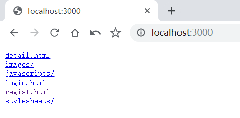
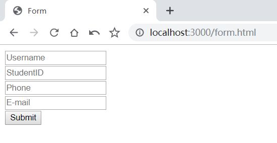
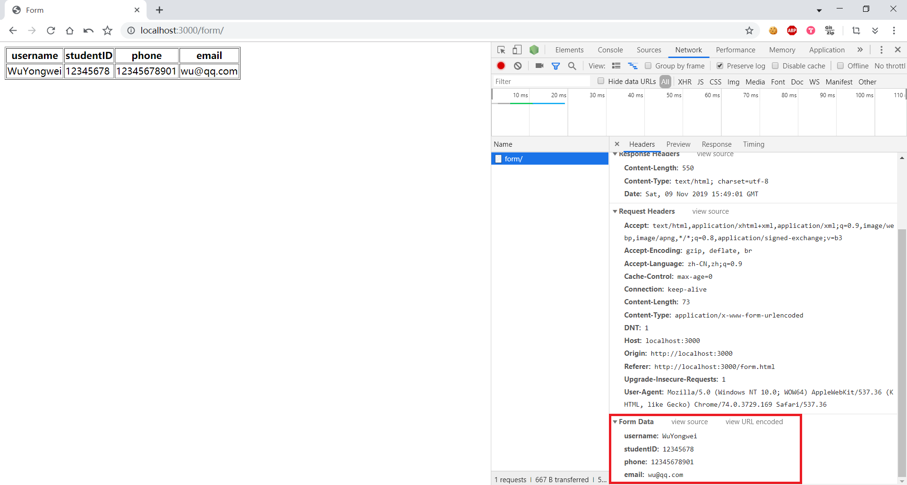
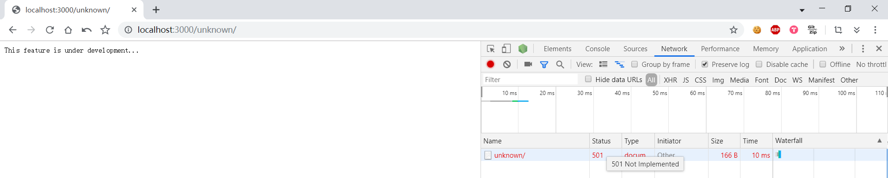

# 处理 web 程序的输入与输出

[toc]

## 概述

设计一个 web 小应用，展示静态文件服务、js 请求支持、模板输出、表单处理、Filter 中间件设计等方面的能力。（不需要数据库支持）

## 任务要求

1. 支持静态文件服务

   > FileServer returns a handler that serves HTTP requests with the contents of the file system rooted at root.
   >
   > To use the operating system's file system implementation, use http.Dir:

   ```go
   http.Handle("/", http.FileServer(http.Dir("./public")))
   ```

   

2. 支持简单 js 访问

   后面实现用到了js

3. 提交表单，并输出一个表格

   - 可以通过 `html.template` 实现

     先将html字符串作为`template`，然后将接收的数据项中提取的元素（在这里是表单值）传给 `template.Execute` 执行因而重写了HTML文本，同时写回到客户端

     ```go
     func dealForm(w http.ResponseWriter, r *http.Request) {
     	switch r.Method {
     	case "POST":
     		if err := r.ParseForm(); err != nil {
     			fmt.Fprintf(w, "ParseForm() err: %v", err)
     			return
     		}
     		
             //Create a template
     		t := template.Must(template.New("form").Parse(templateStr))
     		
             //Struct variable members must be capitalized
     		items := struct {
     			Username, StudentID, Phone, Email string
     		}{Username: r.FormValue("username"), 
               StudentID: r.FormValue("studentID"), 
               Phone: r.FormValue("phone"), 
               Email: r.FormValue("email")}
     		
             //Override template
             t.Execute(w, items)
     	}
     }
     
     //set route
     http.Handle("/form/", http.HandlerFunc(dealForm))
     
     const templateStr = `
     <!DOCTYPE html>
     <html>
     	<head>
     		<meta charset="utf-8">
     		<title>Form</title>
     	</head>
     
     	<body>
     		<div>
     			<table border="1">
                     <tr>
                       <th>username</th>
                       <th>studentID</th>
                       <th>phone</td>
                       <th>email</td>
                     </tr>
                     <tr>
                       <td>{{.Username}}</td>
                       <td>{{.StudentID}}</td>
                       <td>{{.Phone}}</td>
                       <td>{{.Email}}</td>
                     </tr>
                   </table>
     		</div>
     	</body>
     </html>
     `
     ```

     

     

     

   - 我这里是利用了之前Web课程所使用的两个html和两个js实现，一个页面负责填写发送数据，一个页面负责显示数据，页面的切换是通过js里的重定向实现

     ```go
     //User is used to record form data
     type User struct {
     	username, studentID, password, phone, email string
     }
     //Record form information 
     var user User
     
     //Receive form data and process it
     //Reply
     func dealPost(w http.ResponseWriter, r *http.Request) {
     	fmt.Println("in")
         //Only accept form data by POST
     	switch r.Method {
     	case "POST":
             //Parse form
     		if err := r.ParseForm(); err != nil {
     			fmt.Fprintf(w, "ParseForm() err: %v", err)
     			return
     		}
     		//Extract and stored value
     		username := r.FormValue("username")
     		studentID := r.FormValue("studentID")
     		password := r.FormValue("password")
     		phone := r.FormValue("phone")
     		email := r.FormValue("email")
     
     		user = User{username: username, password: password, studentID: studentID, phone: phone, email: email}
     		
             //Reply
     		fmt.Fprintf(w, "Yes")
     	}
     }
     //Send data
     func sendData(w http.ResponseWriter, r *http.Request) {
     	switch r.Method {
     	case "POST":
     		fmt.Fprintf(w, user.username+","+user.studentID+","+user.phone+","+user.email)
     	}
     }
     
     //Set route
     http.Handle("/submit/", http.HandlerFunc(dealPost))
     http.Handle("/loaddata/", http.HandlerFunc(sendData))
     ```

     

     输入信息后提交：

     

4. 对 `/unknown` 给出开发中的提示，返回码 `5xx`

   ```go
   func dealUnknown(w http.ResponseWriter, r *http.Request) {
   	w.WriteHeader(http.StatusNotImplemented)
   	fmt.Fprintf(w, "This feature is under development...")
   }
   
   http.Handle("/unknown/", http.HandlerFunc(dealUnknown))
   ```

   

##  分析阅读 gzip 过滤器的源码 

[Github地址]( https://github.com/phyber/negroni-gzip/ )

### Introduction

> Negroni
>
> Negroni is an idiomatic approach to web middleware in Go. It is tiny, non-intrusive, and encourages use of `net/http`Handlers. 

> Gzip
>
> Gzip middleware for Negroni
>
> Mostly a copy of the Martini gzip module with small changes to make it function under Negroni.  

> compress/gzip
>
> Package gzip implements reading and writing of gzip format compressed files, as specified in [RFC 1952](http://tools.ietf.org/html/rfc1952). 

### 分析

1. 常量

   前面的常量表示 negroni.ResponseWriter 中 Header 的字段名称

   后四个常量从 compress/gzip -> compress/flate copy而来，表示压缩程度，最高是BestCompression

   ```go
   const (
   	encodingGzip = "gzip"
   
   	headerAcceptEncoding  = "Accept-Encoding"
   	headerContentEncoding = "Content-Encoding"
   	headerContentLength   = "Content-Length"
   	headerContentType     = "Content-Type"
   	headerVary            = "Vary"
   	headerSecWebSocketKey = "Sec-WebSocket-Key"
   
   	BestCompression    = gzip.BestCompression
   	BestSpeed          = gzip.BestSpeed
   	DefaultCompression = gzip.DefaultCompression
   	NoCompression      = gzip.NoCompression
   )
   ```

2. 结构体

   ```go
   // gzipResponseWriter is the ResponseWriter that negroni.ResponseWriter is
   // wrapped in.
   type gzipResponseWriter struct {
   	w *gzip.Writer
   	negroni.ResponseWriter
   	wroteHeader bool
   }
   ```

   实现对`negroni.ResponseWriter`的封装

   `gzip.Writer`是一个`WriteCloser`，往其中写的东西会被压缩并输出到其内的一个`io.Writer`成员

   `wroteHeader`表示Response的Header是否已经写过

   ```go
   // handler struct contains the ServeHTTP method
   type handler struct {
   	pool sync.Pool
   }
   ```

    一个`sync.Pool`对象就是一组临时对象的集合，`Pool`用于存储那些被分配了但是没有被使用，而未来可能会使用的值，以减小垃圾回收的压力。 

   ```go
   type gzipResponseWriterCloseNotifier struct {
   	*gzipResponseWriter
   }
   ```

   一个封装用于后面检测http连接是否断开

3. 方法

   ```go
   // Gzip returns a handler which will handle the Gzip compression in ServeHTTP.
   // Valid values for level are identical to those in the compress/gzip package.
   func Gzip(level int) *handler {
   	h := &handler{}
   	h.pool.New = func() interface{} {
   		gz, err := gzip.NewWriterLevel(ioutil.Discard, level)
   		if err != nil {
   			panic(err)
   		}
   		return gz
   	}
   	return h
   }
   ```

   设置`New`为一个返回所需要类型对象的函数，当`Pool`通过`Get`返回其中的任意一个对象。

   如果`Pool`为空，则调用`New`返回一个新创建的对象

   ```go
   // Check whether underlying response is already pre-encoded and disable
   // gzipWriter before the body gets written, otherwise encoding headers
   func (grw *gzipResponseWriter) WriteHeader(code int) {
   	headers := grw.ResponseWriter.Header()
   	if headers.Get(headerContentEncoding) == "" {
   		headers.Set(headerContentEncoding, encodingGzip)
   		headers.Add(headerVary, headerAcceptEncoding)
   	} else {
   		grw.w.Reset(ioutil.Discard)
   		grw.w = nil
   	}
   
   	// Avoid sending Content-Length header before compression. The length would
   	// be invalid, and some browsers like Safari will report
   	// "The network connection was lost." errors
   	grw.Header().Del(headerContentLength)
   
   	grw.ResponseWriter.WriteHeader(code)
   	grw.wroteHeader = true
   }
   ```

   检查是否有潜在的已经被预先解码的但却不可用的response。`ioutil.Discard` 是一个 `io.Writer`，对它进行的任何 Write 调用都将无条件成功。 

   这里grw直接调用了Header()，这是因为Go语言中的结构体可以定义匿名字段。Go语言中没有对象，但是结构体却有大量对象的功能，并且用匿名字段的确可以实现对象的继承和重载。 而这里`gzipResponseWriter`结构体包含了匿名字段`negroni.ResponseWriter`，所以可以直接调用Header()

   ```go
   // Write writes bytes to the gzip.Writer. It will also set the Content-Type
   // header using the net/http library content type detection if the Content-Type
   // header was not set yet.
   func (grw *gzipResponseWriter) Write(b []byte) (int, error) {
   	if !grw.wroteHeader {
   		grw.WriteHeader(http.StatusOK)
   	}
   	if grw.w == nil {
   		return grw.ResponseWriter.Write(b)
   	}
   	if len(grw.Header().Get(headerContentType)) == 0 {
   		grw.Header().Set(headerContentType, http.DetectContentType(b))
   	}
   	return grw.w.Write(b)
   }
   ```

   如果response的header还没有设置，则调用`WriteHeader`设置

   如果`gzip.Writer`为空，就直接往`ResponseWriter`里写，代表着不需要压缩时的情况

   如果`Header`的`Content-Type`还没有被设置，则调用`net/http`的类型检测进行判断再作设置

   最后向`gzip.Writer`写入字节流

   ```go
   func (rw *gzipResponseWriterCloseNotifier) CloseNotify() <-chan bool {
   	return rw.ResponseWriter.(http.CloseNotifier).CloseNotify()
   }
   ```

   检测http连接是否断开(比如客户端主动断开)。如果客户端在响应准备就绪之前已断开连接，则可以使用此机制取消服务器上的长时间操作。

   ```go
   func newGzipResponseWriter(rw negroni.ResponseWriter, w *gzip.Writer) negroni.ResponseWriter {
   	wr := &gzipResponseWriter{w: w, ResponseWriter: rw}
   
   	if _, ok := rw.(http.CloseNotifier); ok {
   		return &gzipResponseWriterCloseNotifier{gzipResponseWriter: wr}
   	}
   
   	return wr
   }
   ```

   `ServeHTTP`方法

   ```go
   // Skip compression if the client doesn't accept gzip encoding.
   if !strings.Contains(r.Header.Get(headerAcceptEncoding), encodingGzip) {
       next(w, r)
       return
   }
   ```

   如果客户端不接受gzip的编码方式，则会跳过不压缩。 

   ```go
   // Skip compression if client attempt WebSocket connection
   if len(r.Header.Get(headerSecWebSocketKey)) > 0 {
       next(w, r)
       return
   }
   ```

   如果客户端尝试WebSocket连接时也跳过不压缩

   > 原因：[StackOverflow]( https://stackoverflow.com/questions/11646680/could-websocket-support-gzip-compression )
   >
   >  WebSocket compression is enabled in some browsers by default (at the time of writing for example in Chrome, but not in Firefox). The client has to include the 'Sec-WebSocket-Extensions: permessage-deflate' header for this. If the server responds with the same extension, the WebSocket communication is compressed on a frame basis. As far as I know, there is no browser API to enable/disable extensions. 

   ```go
   // Retrieve gzip writer from the pool. Reset it to use the ResponseWriter.
   // This allows us to re-use an already allocated buffer rather than
   // allocating a new buffer for every request.
   // We defer g.pool.Put here so that the gz writer is returned to the
   // pool if any thing after here fails for some reason (functions in
   // next could potentially panic, etc)
   gz := h.pool.Get().(*gzip.Writer)
   defer h.pool.Put(gz)
   gz.Reset(w)
   ```

   从pool中获取一个`gzip.Writer`临时对象，然后在函数结束后将其放回到pool中，通过`Reset`清空整个缓冲区以使用`ResponseWriter`，这允许我们重新使用已经分配的缓冲区，而不是为每个请求分配新的缓冲区。

   ```go
   // Wrap the original http.ResponseWriter with negroni.ResponseWriter
   // and create the gzipResponseWriter.
   nrw := negroni.NewResponseWriter(w)
   grw := newGzipResponseWriter(nrw, gz)
   
   // Call the next handler supplying the gzipResponseWriter instead of
   // the original.
   next(grw, r)
   ```

   封装`http.ResponseWriter`为`negroni.ResponseWriter`， 然后创建一个新的`gzipResponseWriter`，调用下一个`handler`

4. 结合官方例子

   ```go
   func main() {
       mux := http.NewServeMux()
       mux.HandleFunc("/", func(w http.ResponseWriter, req *http.Request) {
       	  fmt.Fprintf(w, "Welcome to the home page!")
       })
   
       n := negroni.Classic()
       n.Use(gzip.Gzip(gzip.DefaultCompression))
       n.UseHandler(mux)
       n.Run(":3000")
   }
   ```

   同时参考[飞雪无情的博客 —— Negroni 中间件]( https://www.flysnow.org/2017/09/02/go-classic-libs-negroni-two.html )中关于如何调用中间件的描述

   > `Negroni`是一个HTTP Handler，因为他实现了HTTP Handler接口，所以他可以被`http.ListenAndServe`使用， 其次`Negroni`本身内部又有一套自己的Handler处理链，通过他们可以达到处理http请求的目的，这些Handler处理链中的处理器，就是一个个中间件。
   >
   > 在我们调用`Use`方法的时候，会把`Negroni`的Handler存在自己的`handlers`字段中，这是一个Slice类型字段，可以保存我们存放的`Negroni Handler`。同时会基于这个存放`Negroni Handler`的Slice构建中间件处理链`middleware`。 

   Negroni里的中间件和链表一样，`func (n *Negroni) ServeHTTP(rw http.ResponseWriter, r *http.Request)`作为入口，通过中间件函数中的next参数触发下一个中间件的处理。
   
   执行过程
   
   1. 先`n.Use(gzip.Gzip(gzip.DefaultCompression))`将添加中间件`handler`(一个存储*Writer的Pool)
   
   2. `Negroni`开始按链表调用中间件的`serveHTTP`
   
   3. 如果是客户端不接受`gzip`的编码/尝试WebSocket连接，则跳过本中间件，调用`next`(类似链表的next)
   
   4. 经过一系列封装达到目的
   
      当下一个中间件调用grw.Write()的时候，等于调用了
   
      ```go
      func (grw *gzipResponseWriter) Write(b []byte) (int, error) {
      	...
      	return grw.w.Write(b)
      }
      ```
   
      我们知道grw.w是gzip.Writer，往里写得东西会经过压缩后输出，那么输出到哪里呢？
   
      ```go
      gz.Reset(w)
      ```
   
      > Reset discards the Writer z's state and makes it equivalent to the result of its original state from NewWriter or NewWriterLevel, but writing to w instead. This permits reusing a Writer rather than allocating a new one. 
   
      ```go
      nrw := negroni.NewResponseWriter(w)
      
      // NewResponseWriter creates a ResponseWriter that wraps an http.ResponseWriter
      func NewResponseWriter(rw http.ResponseWriter) ResponseWriter {
      	nrw := &responseWriter{
      		ResponseWriter: rw,
      	}
      
      	if _, ok := rw.(http.CloseNotifier); ok {
      		return &responseWriterCloseNotifer{nrw}
      	}
      
      	return nrw
      }
      
      func (rw *responseWriter) Write(b []byte) (int, error) {
      	if !rw.Written() {
      		// The status will be StatusOK if WriteHeader has not been called yet
      		rw.WriteHeader(http.StatusOK)
      	}
      	size, err := rw.ResponseWriter.Write(b)
      	rw.size += size
      	return size, err
      }
      ```
   
      其实gzip包的内容同时也把negroni包的这些覆盖了，这就避免了我们写到`gzip.Writer`-> `http.ResponseWriter` 的内容与经过`negroni.ResponseWriter`-> `http->ResponseWriter`写出的内容不一样

##  编写中间件 

> 使得用户可以使用 `gb2312` 或 `gbk` 字符编码的浏览器提交表单、显示网页。

我们想要类似Rack，Ring，Connect.js和其他类似解决方案的中间件系统，想要链接多个处理程序。 标准库中已经提供了这类处理程序：`http.StripPrefix（prefix，handler）`和`http.TimeoutHandler（handler，duration，message）`。 它们都将处理程序作为其参数之一，并且都返回处理程序。 

因此，中间件将类似于`func（http.Handler）http.Handler`这样，我们传递处理程序并返回处理程序。 最后，可以通过`http.Handle（pattern，handler）`进行调用。

未测试：

可以修改的地方：尽量不改动Request（这里本来想封装，但是Request好像不太好实现）

```go
package encodetrans

import (
	"bytes"
	"io/ioutil"
	"net/http"
	"strings"

	"github.com/axgle/mahonia"
)

//NewResponse wrapped http.ResponseWriter
type NewResponse struct {
	http.ResponseWriter
}

func (res *NewResponse) Write(b []byte) (int, error) {
	dec := mahonia.NewEncoder("GB18030")
	newContent := dec.ConvertString(string(b))
	bytes := []byte(newContent)

	res.Header().Set("Content-Type", http.DetectContentType(bytes))
	return res.ResponseWriter.Write(bytes)
}

func encodingConversion(next http.Handler) http.Handler {

	return http.HandlerFunc(func(w http.ResponseWriter, r *http.Request) {

		dec := mahonia.NewDecoder("GB18030")
		buf := new(bytes.Buffer)
		buf.ReadFrom(r.Body)
		newContent := dec.ConvertString(buf.String())
		r.Body = ioutil.NopCloser(strings.NewReader(newContent))
		r.ContentLength = int64(len(newContent))

		res := NewResponse{w}
		next.ServeHTTP(&res, r)
	})
}
```

