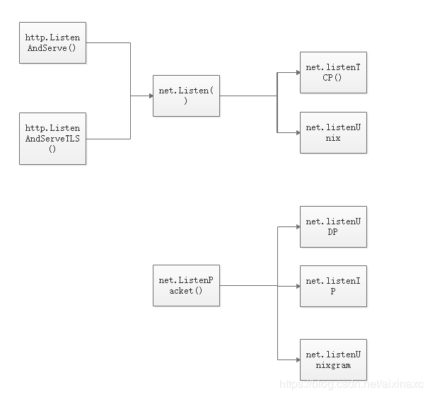
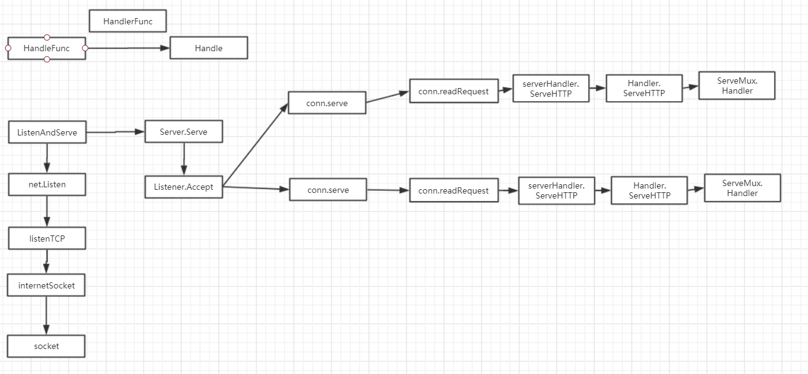

# net/http webserver学习

> Package http provides HTTP client and server implementations. 										
>
> --- [godoc]( https://godoc.org/net/http )

本文内容参考

[astaxie/build-web-application-with-golang]( https://github.com/astaxie/build-web-application-with-golang )

[pmlpml的博客 —— HTTP 协议 与 golang web 应用服务]( https://blog.csdn.net/pmlpml/article/details/78404838 )

[aixinaxc的博客 —— net包 listen - golang]( https://blog.csdn.net/aixinaxc/article/details/88812259 )

[实效Go编程]( https://go-zh.org/doc/effective_go.html )

[toc]

## Web工作方式

 Web是基于http协议的一个服务

> HTTP (Hypertext Transfer Protocol) is the set of rules for transferring files, such as text, graphic images, sound, video, and other multimedia files, on the [World Wide Web](https://whatis.techtarget.com/definition/World-Wide-Web). As soon as a Web user opens their Web [browser](https://searchwindevelopment.techtarget.com/definition/browser), the user is indirectly making use of HTTP. HTTP is an application [protocol](https://searchnetworking.techtarget.com/definition/protocol) that runs on top of the [TCP/IP](https://searchnetworking.techtarget.com/definition/TCP-IP) suite of protocols (the foundation protocols for the Internet).  


 浏览器本身是一个客户端，平时我们输入网址访问的一个完整过程如下

1. 浏览器 -> 先通过本地Host / DNS服务器 ，获取相应域名对应的IP
2. 浏览器 ->  通过 socket 与 服务器发起 `TCP` 连接请求 
3. 服务器 -> `Accept` 客户端请求，建立该连接
4. 浏览器 -> 客户端向服务器发送HTTP协议请求包，请求服务器里的资源文档（Request）
5. 服务器 ->  向客户机发送HTTP协议应答包，如果请求的资源包含有动态语言的内容，那么服务器会调用动态语言的解释引擎负责处理“动态内容”，并将处理得到的数据返回给客户端 
6. 浏览器 -> 断开连接，让双方释放资源，客户端解释HTML文档，在客户端屏幕上渲染图形结果

 客户机与服务器之间的通信是非持久连接的

而在**服务器端**，一般有以下的概念

Request：用户请求的信息，用来解析用户的请求信息，包括post、get、cookie、url等信息

Response：服务器需要反馈给客户端的信息

Conn：用户的每次请求链接

Handler：处理请求和生成返回信息的处理逻辑


## 一个官方例子

 一个Web服务器。该程序其实只是个Web服务器的重用。Google在[http://chart.apis.google.com](http://chart.apis.google.com/) 上提供了一个将表单数据自动转换为图表的服务，以下程序就是根据 向本服务器提交表单，从中获取字段s，然后通过http/template返回一个已经填充完毕的html文件

各部分解释在注释中给出

```go
package main

import (
    "flag"
    "html/template"
    "log"
    "net/http"
)
//根据启动参数addr设置监听端口，默认为1718
var addr = flag.String("addr", ":1718", "http service address") // Q=17, R=18
//帮助程序，包装对一个返回(*Template, error)的函数的调用
//所包装的函数：分配一个名为qr的html模板，将文本templateStr解析为qr的模板主体
var templ = template.Must(template.New("qr").Parse(templateStr))

func main() {
    //解析启动参数
    flag.Parse()
    //设置访问的路由，将QR函数绑定到服务器的根路径
    http.Handle("/", http.HandlerFunc(QR))
    //设置监听端口，启动服务器
    err := http.ListenAndServe(*addr, nil)
    if err != nil {
        log.Fatal("ListenAndServe:", err)
    }
}

func QR(w http.ResponseWriter, req *http.Request) {
    //将已解析的模板应用于指定的数据对象，并将输出写入w即输出到客户端
    templ.Execute(w, req.FormValue("s"))
}

//从 {{if .}} 到 {{end}} 的代码段仅在当前数据项（这里是点 .）的值非空时才会执行
const templateStr = `
<html>
<head>
<title>QR Link Generator</title>
</head>
<body>
{{if .}}

<br>
{{.}}
<br>
<br>
{{end}}
<form action="/" name=f method="GET"><input maxLength=1024 size=70
name=s value="" title="Text to QR Encode"><input type=submit
value="Show QR" name=qr>
</form>
</body>
</html>
`
```


## 代码分析

接下来，我们就根据上述程序所调用的函数一步步地看net/http的实现原理

上述程序中使用了 `net/http` 包中的三个函数 `Handle()` `HandleFunc()` `ListenAndServe()`

但是在godoc中可以看到，上述函数都出现了两次，前两者都在 结构体` ServeMux `中作为方法、以及函数 出现过，而后者 在结构体`Server`中作为方法、以及函数 出现。

我们先来看看这几个接口/结构体，至于具体出现多次的原因现在还不能看出来

- struct **ServeMux**

  > ServeMux is an HTTP request multiplexer. It matches the URL of each incoming request against a list of registered patterns and calls the handler for the pattern that most closely matches the URL.

  ```go
  type ServeMux struct {
  	mu    sync.RWMutex	//由于GO高并发处理，需要锁机制
  	m     map[string]muxEntry	//映射 string-> muxEntry
  	es    []muxEntry // slice of entries sorted from longest to shortest.
  	hosts bool       // whether any patterns contain hostnames
  }
  ```

  再来看看**muxEntry**

  ```go
  type muxEntry struct {
  	h       Handler	
  	pattern string	
  }
  ```

  ```go
  type Handler interface {
  	ServeHTTP(ResponseWriter, *Request)
  }
  ```

  > ServeHTTP should write reply headers and data to the ResponseWriter and then return. Returning signals that the request is finished; it is not valid to use the ResponseWriter or read from the Request.Body after or concurrently with the completion of the ServeHTTP call.

  从`ServeHTTP`的参数以及注释可以看出，`Handler`接口的作用是来处理http请求并发送http响应，那么`muxEntry`就是存储http处理器`handler`和对应的模式(匹配字符串)`pattern` ，当`ServeMux`接到请求之后，会先在映射`m`中查找对应path是否存在，若不存在在`es`中遍历选择最长匹配的`pattern`的`muxEntry`进行处理。

  但是，我们会发现在主程序中并没有创建`ServeMux`，那么我们又是如何使用到它的呢？

  看一下函数（不是方法！）http.ListenAndServe

  ```go
  // The handler is typically nil, in which case the DefaultServeMux is used.
  func ListenAndServe(addr string, handler Handler) error {
  	server := &Server{Addr: addr, Handler: handler}
  	return server.ListenAndServe()
  }
  ```

  创建了一个server，然后调用了server的`ListenAndServe`方法，而注释中提到Handler通常为nil

  再来看一下**Server**结构体

  ```go
  type Server struct {
  	Addr    string  // TCP address to listen on, ":http" if empty
  	Handler Handler // handler to invoke, http.DefaultServeMux if nil
      ...
  }
  ```

  所以，http中存在一个DefaultServeMux，当使用http包时默认情况下会实例化它

  ```go
  // DefaultServeMux is the default ServeMux used by Serve.
  var DefaultServeMux = &defaultServeMux
  
  var defaultServeMux ServeMux
  ```

  HTTP包提供了一些用于使用DefaultServeMux的快捷方式：http.Handle和http.HandleFunc。这就是上面**为什么这些函数出现了两次的原因**，不同之处在于它们将处理程序添加到DefaultServeMux，而不是您创建的处理程序。

  但是，在实际中不应使用DefaultServeMux，因为它会带来安全风险。DefaultServeMux存储在全局变量中，所以任何程序包都可以访问它并注册路由-包括应用程序导入的任何第三方程序包。如果这些第三方程序包之一遭到破坏，则它们可以使用DefaultServeMux将恶意处理程序暴露给Web。

- **接下来我们再了解一下`ServeMux`结构体的 `Handle ` 和 `HandleFunc` 方法** 

  ```go
  type HandlerFunc func(ResponseWriter, *Request)
  // ServeHTTP calls f(w, r).
  func (f HandlerFunc) ServeHTTP(w ResponseWriter, r *Request) {
  	f(w, r)
  }
  
  // HandleFunc registers the handler function for the given pattern.
  func (mux *ServeMux) HandleFunc(pattern string, handler func(ResponseWriter, *Request)) {
  	if handler == nil {
  		panic("http: nil handler")
  	}
  	mux.Handle(pattern, HandlerFunc(handler))
  }
  ```

  之前可能还会有些疑惑，我们需要传入一个函数作为`Handler`，但是我们的函数如何实现`Handler`的接口呢?

  将参数为(ResponseWriter, \*Request)的函数定义为`HandlerFunc`，则具有该参数类型的任何函数都可以转换为`HandlerFunc`类型，并且实现了`ServeHTTP`方法即实现了`Handler`接口，从而达到强制普通(符合要求的)函数满足`Handler`接口的效果。

  而如果我们要为其注册处理程序的每个路径定义一个实现`Handler`接口的类型可能会很麻烦。 因此，提供了便捷方法`HandleFunc`来将具有指定签名的任何函数注册为`Handler`函数。

  ```go
  // Handle registers the handler for the given pattern.
  // If a handler already exists for pattern, Handle panics.
  func (mux *ServeMux) Handle(pattern string, handler Handler) {
  	mux.mu.Lock()
  	defer mux.mu.Unlock()
  
  	if pattern == "" {
  		panic("http: invalid pattern")
  	}
  	if handler == nil {
  		panic("http: nil handler")
  	}
  	if _, exist := mux.m[pattern]; exist {
  		panic("http: multiple registrations for " + pattern)
  	}
  
  	if mux.m == nil {
  		mux.m = make(map[string]muxEntry)
  	}
  	e := muxEntry{h: handler, pattern: pattern}
  	mux.m[pattern] = e
  	if pattern[len(pattern)-1] == '/' {
  		mux.es = appendSorted(mux.es, e)
  	}
  
  	if pattern[0] != '/' {
  		mux.hosts = true
  	}
  }
  ```

  Handle注册HTTP处理器handler和对应的模式pattern。如果该模式已经注册有一个处理器，Handle会panic。

- **`Server`结构体的`ListenAndServe`方法**

  ```go
  // ListenAndServe listens on the TCP network address srv.Addr and then
  // calls Serve to handle requests on incoming connections.
  func (srv *Server) ListenAndServe() error {
  	if srv.shuttingDown() {
  		return ErrServerClosed
  	}
  	addr := srv.Addr
  	if addr == "" {
  		addr = ":http"
  	}
  	ln, err := net.Listen("tcp", addr)
  	if err != nil {
  		return err
  	}
  	return srv.Serve(ln)
  }
  
  //package net
  func Listen(network, address string) (Listener, error) {
  	var lc ListenConfig
  	return lc.Listen(context.Background(), network, address)
  }
  
  // Listen announces on the local network address.
  func (lc *ListenConfig) Listen(ctx context.Context, network, address string) (Listener, error) {
  	addrs, err := DefaultResolver.resolveAddrList(ctx, "listen", network, address, nil)
  	if err != nil {
  		return nil, &OpError{Op: "listen", Net: network, Source: nil, Addr: nil, Err: err}
  	}
  	sl := &sysListener{
  		ListenConfig: *lc,
  		network:      network,
  		address:      address,
  	}
  	var l Listener
  	la := addrs.first(isIPv4)
  	switch la := la.(type) {
  	case *TCPAddr:
  		l, err = sl.listenTCP(ctx, la)
  	case *UnixAddr:
  		l, err = sl.listenUnix(ctx, la)
  	default:
  		return nil, &OpError{Op: "listen", Net: sl.network, Source: nil, Addr: la, Err: &AddrError{Err: "unexpected address type", Addr: address}}
  	}
  	if err != nil {
  		return nil, &OpError{Op: "listen", Net: sl.network, Source: nil, Addr: la, Err: err} // l is non-nil interface containing nil pointer
  	}
  	return l, nil
  }
  ```

  > http的监听是对net.Listen()的封装，而net.Listen()是对Tcp和Unix的封装。而http的监听传入的都是tcp。所有http的监听最终都是实现的net.ListenTcp()。 

  

  由于其中涉及很多net包的内容，所以不过多深入，根据文档中关于net的解释，`ListenAndServe`的功能是实现一级一级的调用，从而进行设置然后在系统调用中打开一个socket

  ListenTCP --> listenTCP --> internetSocket --> socket --> listenStream

  接下来继续看`ListenAndServe`的返回值

- `Serve`结构体的`Serve`方法

  ```go
  // Serve accepts incoming connections on the Listener l, creating a
  // new service goroutine for each. The service goroutines read requests and
  // then call srv.Handler to reply to them.
  func (srv *Server) Serve(l net.Listener) error {
  	if fn := testHookServerServe; fn != nil {
  		fn(srv, l) // call hook with unwrapped listener
  	}
  
  	origListener := l
  	l = &onceCloseListener{Listener: l}
  	defer l.Close()
  
  	if err := srv.setupHTTP2_Serve(); err != nil {
  		return err
  	}
  
  	if !srv.trackListener(&l, true) {
  		return ErrServerClosed
  	}
  	defer srv.trackListener(&l, false)
  
  	var tempDelay time.Duration // how long to sleep on accept failure
  
  	baseCtx := context.Background()
  	if srv.BaseContext != nil {
  		baseCtx = srv.BaseContext(origListener)
  		if baseCtx == nil {
  			panic("BaseContext returned a nil context")
  		}
  	}
  
  	ctx := context.WithValue(baseCtx, ServerContextKey, srv)
  	for {
  		rw, e := l.Accept()
  		if e != nil {
  			select {
  			case <-srv.getDoneChan():
  				return ErrServerClosed
  			default:
  			}
  			if ne, ok := e.(net.Error); ok && ne.Temporary() {
  				if tempDelay == 0 {
  					tempDelay = 5 * time.Millisecond
  				} else {
  					tempDelay *= 2
  				}
  				if max := 1 * time.Second; tempDelay > max {
  					tempDelay = max
  				}
  				srv.logf("http: Accept error: %v; retrying in %v", e, tempDelay)
  				time.Sleep(tempDelay)
  				continue
  			}
  			return e
  		}
  		if cc := srv.ConnContext; cc != nil {
  			ctx = cc(ctx, rw)
  			if ctx == nil {
  				panic("ConnContext returned nil")
  			}
  		}
  		tempDelay = 0
  		c := srv.newConn(rw)
  		c.setState(c.rwc, StateNew) // before Serve can return
  		go c.serve(ctx)
  	}
  }
  ```

  传进来的是一个`net.Listener`，`Serve`先在服务器上配置HTTP/2，然后将`net.Listener`添加到服务器的监听列表` listeners `中，初始化上下文

  > ```go
  > ctx := context.WithValue(baseCtx, ServerContextKey, srv)
  > ```
  >
  > 接收 context 并返回派生 context，其中值 val 与 key 关联，并通过 context 树与 context 一起传递。这意味着一旦获得带有值的 context，从中派生的任何 context 都会获得此值。 

  用于保存key为ServerContextKey，value是对应的Server服务，管理每个连接Conn的goroutine。

  然后创建一个循环，通过`Listener.Accept`监听并返回下一个tcp连接Conn，若返回错误，则进行错误处理（Server关闭/接收错误），然后通过`newConn`将`net.Conn`封装成`http.Conn`，然后建立新的协程来处理新的连接的读写事件， 这样每个请求都能保持独立，相互不会阻塞。这里就要提到Golang的高并发的特性， goroutine(协程更轻量，占用内存更小，这是它能做到高并发的前提)是go并行的关键 。

  ```go
  // Create new connection from rwc.
  func (srv *Server) newConn(rwc net.Conn) *conn {
  	c := &conn{
  		server: srv,
  		rwc:    rwc,
  	}
  	if debugServerConnections {
  		c.rwc = newLoggingConn("server", c.rwc)
  	}
  	return c
  }
  
  func (c *conn) setState(nc net.Conn, state ConnState) {
  	srv := c.server
  	switch state {
  	case StateNew:
  		srv.trackConn(c, true)
  	case StateHijacked, StateClosed:
  		srv.trackConn(c, false)
  	}
  	if state > 0xff || state < 0 {
  		panic("internal error")
  	}
  	packedState := uint64(time.Now().Unix()<<8) | uint64(state)
  	atomic.StoreUint64(&c.curState.atomic, packedState)
  	if hook := srv.ConnState; hook != nil {
  		hook(nc, state)
  	}
  }
  
  // Serve a new connection.
  func (c *conn) serve(ctx context.Context)
  ```

  先封装`nett.Listener`，根据`debugServerConnections`判断是否所有服务器连接都已经被包装，否的话重新封装`rwc`，然后通过`setState`将这个连接添加到活跃连接`activeConn`中，然后原子地存储一些状态消息

  最后在`serve`方法中（源代码太长，这里不给出）， 也使用了goroutines来处理Conn的读写事件

  通过循环读取每个请求的内容

  ```go
  w, err := c.readRequest(ctx)
  ```

  同时需要context上下文来管理

  ```go
  ctx = context.WithValue(ctx, LocalAddrContextKey, c.rwc.LocalAddr())
  
  ctx, cancelCtx := context.WithCancel(ctx)
  c.cancelCtx = cancelCtx
  defer cancelCtx()
  ```

  然后通过连接中保存地服务器信息，获取到对应的`ServeHTTP`进行判断handler是否为空，如果没有设置`handler`，`handler`就设置为`DefaultServeMux`。接着调用`handler.ServeHTTP`，如果是请求是*那么关闭链接，否则调用`mux.Handler(r)`返回对应设置路由的处理Handler，然后执行`h.ServeHTTP(w, r) `

  ```go
  serverHandler{c.server}.ServeHTTP(w, w.req)
  
  func (sh serverHandler) ServeHTTP(rw ResponseWriter, req *Request) {
  	handler := sh.srv.Handler
  	if handler == nil {
  		handler = DefaultServeMux
  	}
  	if req.RequestURI == "*" && req.Method == "OPTIONS" {
  		handler = globalOptionsHandler{}
  	}
  	handler.ServeHTTP(rw, req)
  }
  // ServeHTTP dispatches the request to the handler whose
  // pattern most closely matches the request URL.
  func (mux *ServeMux) ServeHTTP(w ResponseWriter, r *Request) {
  	if r.RequestURI == "*" {
  		if r.ProtoAtLeast(1, 1) {
  			w.Header().Set("Connection", "close")
  		}
  		w.WriteHeader(StatusBadRequest)
  		return
  	}
  	h, _ := mux.Handler(r)
  	h.ServeHTTP(w, r)
  }
  ```

  > HTTP cannot have multiple simultaneous active requests.Until the server replies to this request, it can't read another, so we might as well run the handler in this goroutine.		
  > Not strictly true: HTTP pipelining. We could let them all processin parallel even if their responses need to be serialized.But we're not going to implement HTTP pipelining because it was never deployed in the wild and the answer is HTTP/2.

## 总结

