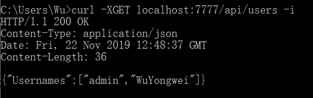
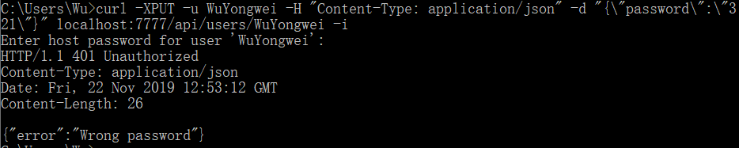

#  设计一个博客网站的REST API 

> 要求：模仿 Github，设计一个博客网站的 API 
>
>  规范：REST API 设计 [Github API v3 overview](https://developer.github.com/v3/)；[微软](https://docs.microsoft.com/zh-cn/azure/architecture/best-practices/api-design)  

[toc]

## [Github项目地址]( https://github.com/wywwwwei/ServiceComputingOnCloud/tree/master/HW6_RESTapi )

## REST简介

> REST 是一种基于超媒体构建分布式系统的架构风格。 REST 独立于任何基础协议，并且不一定绑定到 HTTP。 但是，最常见的 REST 实现使用 HTTP 作为应用程序协议 。
>
>  HTTP 设计 RESTful API 时的一些主要原则：
>
> - REST API 围绕资源设计，资源是可由客户端访问的任何类型的对象、数据或服务。 
> -  每个资源有一个标识符，即，唯一标识该资源的 URI。 
> -  客户端通过交换资源的表示形式来与服务交互。 许多 Web API 使用 JSON 作为交换格式。 
> -  REST API 使用统一接口，这有助于分离客户端和服务实现。 对于基于 HTTP 构建的 REST API，统一接口包括使用标准 HTTP 谓词对资源执行操作。 最常见的操作是 GET、POST、PUT、PATCH 和 DELETE。 
> -  REST API 使用无状态请求模型。 HTTP 请求应是独立的并可按任意顺序发生，因此保留请求之间的瞬时状态信息并不可行。 信息的唯一存储位置就在资源内，并且每个请求应是原子操作。 
> -  REST API 由表示形式中包含的超媒体链接驱动。 

## Version

### Current version

媒体类型版本控制，  当客户端应用程序向 Web 服务器发送 HTTP GET 请求时，它应使用 Accept 标头规定它可以处理的内容的格式。  如果 Accept 标头未指定任何已知的媒体类型，则 Web 服务器可以生成 HTTP 406（不可接受）响应消息或返回使用默认媒体类型的消息。 

```
Accept: application/vnd.adventure-blog.v1+json
```

这里只是说用这种方式，但是我们只有一个版本，所以在具体代码中不实现该策略。

## Users

### User Authentication

> 这里要求每次在申请需要验证用户权限的api时都附上-u，因为不保存session
>
> 默认用户admin:admin拥有一切权限

HTTP基本认证

```
curl -u "username" localhost:7777/api
```

### User Regist

```
POST localhost:7777/api/users
```

| POST     | DESCIPTION | TYPE   |
| -------- | ---------- | ------ |
| username | 用户名     | string |
| password | 密码       | string |

#### 测试

- 注册username:WuYongwei password:123的用户

  

- 当重复注册时

  

### Get all usernames

```
GET localhost:7777/api/users
```

#### 测试

- 列举所有玩家

  

### Update password

> need user authentication
>

```
PUT localhost:7777/api/users/username
```

| PUT         | DESCPRITION | TYPE   |
| ----------- | ----------- | ------ |
| newPassword | 新的密码    | string |

#### 测试

- 当成功修改时

  

- 当原密码输入错误时

  

- 当修改密码账户与验证账户不一致时

  

### Delete user

> need user authentication

```
DELETE localhost:7777/api/users/username
```

#### 测试

- 删除用户成功

  

> 下面的测试将上述删除用户重新添加进去

## Blog

### Get User Blogs

```
GET localhost:7777/api/blogs/user/username
```

> 该测试是在完成New Blog之后

#### 测试

- 获取username所写过的博客简介

  

### Get Blog

```
GET localhost:7777/api/blogs/blogID
```

> 该测试是在完成New Blog之后

#### 测试

- 获取博客详情

  

### New Blog

> need user authentication

```
POST localhost:7777/api/blogs
```

| POST       | DESCRIPTION    | TYPE            |
| ---------- | -------------- | --------------- |
| title      | 标题           | string          |
| content    | 正文           | string          |
| categories | 分类（可多个） | array of string |

#### 测试

- 提交新博客

  

### Edit Blog

> need user authentication

```
PUT localhost:7777/api/blogs/blogID
```

| PUT        | DESCRIPTION    | TYPE            |
| ---------- | -------------- | --------------- |
| title      | 标题           | string          |
| content    | 正文           | string          |
| categories | 分类（可多个） | array of string |

#### 测试

- 当成功修改时

  

### Delete Blog

> need user authentication

```
DELETE localhost:7777/api/blogs/blogID
```

#### 测试


## Category

### Get all current categories

```
GET localhost:7777/api/categories
```

#### 测试


### New Category

```
POST localhost:7777/api/categories
```

| POST         | DESCRIPTION | TYPE   |
| ------------ | ----------- | ------ |
| categoryName | 类别名称    | string |

#### 测试


### Get Category Blog

```
GET localhost:7777/api/categories/categoryID
```

#### 测试


### Update Category name

```
PUT localhost:7777/api/categories/categoryID
```

| PUT          | DESCRIPTION | TYPE   |
| ------------ | ----------- | ------ |
| categoryName | 类别名称    | string |

#### 测试


### Delete Category

> need admin authentication

```
DELETE localhost:7777/api/actegories/categoryID
```

#### 测试


## 不足之处

- 错误处理不够
- 大量地使用了map，以致数据处理较慢
- 没有实现异步操作