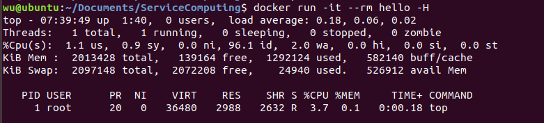

# MySQL与容器化

[toc]

## 容器化技术

> 虚拟化是一组软件技术，使软件应用程序可以在虚拟硬件（通过虚拟机和虚拟机管理程序进行虚拟化）或虚拟操作系统（通过容器进行虚拟化）上运行。

容器是一种虚拟运行时环境，它在单个操作系统（OS）内核之上运行，并模拟操作系统而不是基础硬件。容器引擎是用于部署容器化应用程序的托管环境。容器引擎为容器分配核心和内存，实现空间隔离和安全性，并通过启用容器来提供可伸缩性。

每个容器共享主机OS内核，通常也共享二进制文件和库。共享组件是只读的。因此，容器异常轻便。

容器化可以实现更大的模块化。可以将应用程序拆分为模块（例如数据库，应用程序前端等），而不是在单个容器中运行整个复杂的应用程序。这就是所谓的微服务方法。用这种方式构建的应用程序更易于管理，因为每个模块都相对简单，并且无需重新构建整个应用程序即可对模块进行更改。因为容器非常轻巧，所以只有在需要它们时才能实例化单个模块（或微服务），并且几乎可以立即使用它们。

## Docker核心概念

> 引用 [Docker overview —— docker docs](https://docs.docker.com/engine/docker-overview/)

Docker是供开发人员和系统管理员开发，交付和运行应用程序的平台。Docker使您可以从组件快速组装应用程序，并消除了交付代码时可能产生的摩擦。Docker使您可以尽快测试代码并将其部署到生产中。其包括

- Docker Engine - 轻量级功能强大的开源容器化技术，结合了用于构建和容器化应用程序的工作流程。
- Docker Hub - SaaS服务，用于共享和管理应用程序堆栈。

### Docker Engine

Docker Engine支持构建，交付和运行基于容器的应用程序所涉及的任务和工作流程。该引擎创建一个服务器端守护进程，以承载映像，容器，网络和存储卷。该引擎还提供了一个客户端命令行界面（CLI），使用户可以通过Docker Engine API与守护程序进行交互。Docker Engine会自动调整设置和条件，以确保实际状态始终与所需状态保持一致。


### Docker Architecture

- 镜像(image) – 类比执行程序

  > an **executable package** that includes everything needed to run an application--the code, a runtime, libraries, environment variables, and configuration files.

- 容器(Container) – 类比进程

  > a runtime instance of an image--what the image becomes in memory when executed (that is, an image with state, or a **user process**).

- 仓库（Registry）– 类比 repository

  > 存放不同版本镜像的地方

- 主机（Host / Node）

  > 运行容器的服务器

- 服务（Service）

  > 一个镜像之上运行的一组可伸缩的容器集合，运行在一个容器集群中提供同一功能服务

- 栈（Stack）/ 命名空间（Namaspace） / 应用（Application）

  >被编排的、可伸缩的一组相互依赖的服务，构成的一个应用


- Docker daemon

  Daemon是Docker的守护进程，负责侦听（来自Client的）Docker API请求并管理Docker对象，例如图像，容器，网络，还可以与其他守护程序通信以管理Docker服务。

- Docker client

  Docker client 是许多Docker用户与Docker交互的主要方式。

## 容器构建与应用容器化

> 参考[docker教程,dockerfile教程——数据架构师的CSDN博客](https://blog.csdn.net/luanpeng825485697/article/details/80921390)

实验环境：Ubuntu Bionic 18.04 (LTS)

### 构建Docker镜像练习

1. 使用Docker仓库安装Docker

   > 参考[Ubuntu Docker 安装——菜鸟教程](https://www.runoob.com/docker/ubuntu-docker-install.html)

   - 首次安装 Docker Engine-Community 之前，需要设置 Docker 仓库

     ```shell
     #更新 apt 包索引
     sudo apt-get update
     
     #安装 apt 依赖包，用于通过HTTPS来获取仓库
     sudo apt-get install apt-transport-https ca-certificates curl gnupg-agent \
     	software-properties-common
     
     #添加 Docker 的官方 GPG 密钥
     curl -fsSL https://download.docker.com/linux/ubuntu/gpg | sudo apt-key add -
     
     #验证是否拥有带有指纹的密钥
     sudo apt-key fingerprint 0EBFCD88
     
     #设置稳定版仓库
     # $(lsb_release -cs) 表示当前Ubuntu版本(这里我是bionic)
     # xenial 16.04 (LTS)
     # bionic 18.04 (LTS)
     # cosmic 18.10
     # disco 19.04
     sudo add-apt-repository \
        "deb [arch=amd64] https://download.docker.com/linux/ubuntu \
       $(lsb_release -cs) \
       stable"
     ```

   - 安装 Docker Engine-Community

     ```shell
     #更新 apt 包索引
     sudo apt-get update
     
     #安装最新版本的 Docker Engine-Community 和 containerd
     sudo apt-get install docker-ce docker-ce-cli containerd.io
     ```

   - 检查 docker 安装

     

2. 创建镜像

   **当我们从docker镜像仓库中下载的镜像不能满足我们的需求时**，我们可以通过以下两种方式对镜像进行更改

   - 从已经创建的容器中更新镜像，并且提交这个镜像
   - 使用 Dockerfile 指令来创建一个新的镜像

   这次实验我们就是通过命令docker build 创建一个新的镜像。为此，我们需要创建一个 Dockerfile 文件，其中包含一组指令来告诉 Docker 如何构建我们的镜像

   Dockerfile如下

   ```shell
   FROM ubuntu
   ENTRYPOINT ["top","-b"]
   CMD ["-c"]
   ```

   把Dockerfile文件放在本地应用目录，然后在Dockerfile的目录执行

   ```shell
   #hello为镜像的名称 .表示当前目录 -f可以指定Dockerfile文件的地址
   docker build . -t hello
   ```

   

3. 运行镜像

   ```shell
   # docker run 参数
   # -i: 以交互模式运行容器，通常与 -t 同时使用
   # -t: 为容器重新分配一个伪输入终端，通常与 -i 同时使用
   # --rm:指定容器停止后自动删除容器
   docker run -it --rm hello -H
   ```

   

### 使用MySQL容器

1. 启动服务器

   ```shell
   #--name DokerTest 为容器指定一个名称
   #-e MYSQL_ROOT_PASSWORD=test 设置环境变量(这里设置了数据库密码)
   #-p(注意是小写!!): 端口映射，格式为：主机(宿主)端口:容器端口
   #-d: 后台运行容器，并返回容器ID
   docker run -p 3306:3306 --name DockerTest -e MYSQL_ROOT_PASSWORD=test -d mysql:5.7
   ```

   这里映射容器服务的 3306 端口到宿主机的 3306 端口，外部主机可以直接通过 宿主机ip:3306 访问到 MySQL 的服务

   

   

2. 挂载卷Volume保存db

   - 查看数据库文件

     ```shell
     #进入正在运行的容器DockerTest内部，同时运行bash
     docker exec -it DockerTest bash
     ls /var/lib/mysql
     ```

     

   - 目前所挂载的卷

     同时我们查看[Dockerfile](https://github.com/docker-library/mysql/blob/master/5.7/Dockerfile)中有

     ```dockerfile
     VOLUME /var/lib/mysql
     ```

     表明每次启动 MySQL容器，docker 创建一个文件卷挂载在容器内/var/lib/mysql位置

     ```shell
     docker volume ls
     docker inspect -f "{{.Mounts}}" DockerTest
     docker volume inspect $Volume_name
     ```

     

     可以看到这个卷在宿主机（host）的 /var/lib/docker/volumes/ 目录下

   - 创建卷

     首先我们得删除之前的容器和卷

     ```shell
     #-f Force the removal of a running container (uses SIGKILL)
     #-v Remove the volumes associated with the container
     #直接通过容器ID删除
     docker rm a735137b8b6f
     #当容器较多时，可通过grep获取对应容器名的docker ps -a行，然后awk切片输出所需内容
     docker rm $(docker ps -a|grep DockerTest|akw '{print $1}') -f -v
     ```

     

     创建卷

     ```shell
     docker volume create testdb
     ```

     

   - 挂载

     ```shell
     docker run --name DockerTest -e MYSQL_ROOT_PASSWORD=test -v testdb:/var/lib/mysql -d mysql:5.7
     ```

     

   - 启动客户端容器链接服务器

     ```shell
     #--link 添加链接到另一个容器，指定容器间的关联，使用其他容器的IP、env等信息
     # DockerTest表示你需要通信的容器名,mysql表示内部访问,即客户端可通过它访问服务器
     docker run --name testClient --link DockerTest:mysql -it mysql:5.7 bash
     ```

     我们先来查看一下环境变量

     

     再连接服务端试试

     

### Docker compose与多容器应用自动化部署

Compose 是用于定义和运行多容器 Docker 应用程序的工具。通过 Compose，您可以使用 YML 文件来配置应用程序需要的所有服务。然后，使用一个命令，就可以从 YML 文件配置中创建并启动所有服务。

Compose 使用的三个步骤：

- 使用 Dockerfile 定义应用程序的环境。
- 使用 docker-compose.yml 定义构成应用程序的服务，这样它们可以在隔离环境中一起运行。
- 最后，执行 docker-compose up 命令来启动并运行整个应用程序。

1. Docker compose 安装

   > 参考[Install Docs](https://docs.docker.com/compose/install/)

   ```shell
   #下载二进制包
   sudo curl -L https://github.com/docker/compose/releases/download/1.25.1-rc1/docker-compose-`uname -s`-`uname -m` -o /usr/local/bin/docker-compose
   #将可执行权限应用于二进制文件
   sudo chmod +x /usr/local/bin/docker-compose
   #创建软链
   sudo ln -s /usr/local/bin/docker-compose /usr/bin/docker-compose
   #测试是否安装成功
   docker-compose --version
   ```

   

2. 编写stack.yml文件

   ```yml
   version: '3.1'
   services:
     db:
       image: mysql:5.7
       command: --default-authentication-plugin=mysql_native_password
       restart: always
       environment:
         MYSQL_ROOT_PASSWORD: test
     adminer:
       image: adminer
       restart: always
       ports:
         - 8080:8080
   ```

   该 Compose 文件定义了两个服务：db和 adminer

   - db

      该服务使用 Docker Hub 的公共 mysql映像，配置环境变量并设置重启策略(容器总是重新启动)

   - adminer

     是一个数据库管理工具，该服务使用 Docker Hub 的公共 adminer映像，它设置重启策略(容器总是重新启动)，并将容器和主机绑定到暴露的端口 8080。

3. 启动服务

   ```shell
   #同样可以使用 -f 指定yml文件
   docker-compose up
   ```

   

4. 访问

   

   

5. 停止和删除

   ```shell
   #同样可以使用 -f 指定yml文件
   docker-compose down
   ```

   